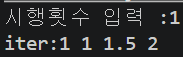
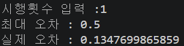
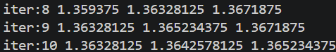
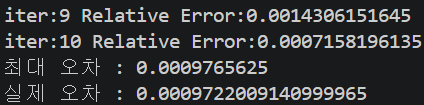
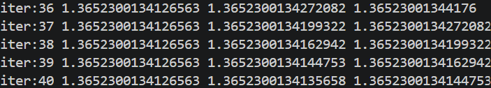
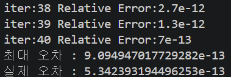
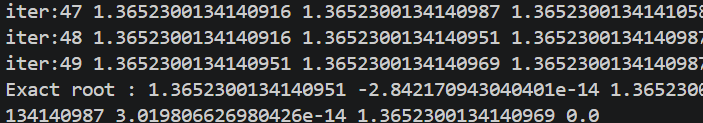
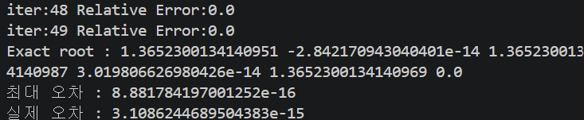

# Bisection Method
---
## 1. 프로젝트 소개

이 프로젝트는 Bisection Method를 이용하여 비선형 함수 f의 근을 수치적으로 근사하는 알고리즘을 구현하였다.

또한, 수학적으로 계산된 계산속도와 오차범위를 결과와 비교하여 정확성을 검증하였다.

## 2. 수학적 원리

Bisection Method는 중간값정리를 이용한다.

함수 f(x)가 구간 [a,b]에서 연속이고 $f(a)f(b)$ 이면, (a,b)사이에 적어도 하나의 근이 존재한다.

만약 중간값정리에 의해 근의 존재가 확인된다면 구간을 반으로 나눠 $(a+b)/2$ 와 중간값정리가 성립하는 a 또는 b를 찾는다.

이 과정을 반복하면 $(a+b)/2$ 는 수치적으로 근에 근사한다.

초기 구간 길이가 $b-a$ 이면 n번 반복 후 구간 길이는 $(b-a)/2^n$ 이기 때문에 근사해와 근의 오차는 $|c_n-r|<=(b-a)/(2^n)$ 이다.

n-1번째 오차와 n번째 오차의 비율(Relative Error)로 Iteration의 속도를 알 수 있다.

## 3. 알고리즘

함수 f에 대해 $f(a)f(b)<0$ 인 초기구간 [a,b]를 선택한다.

step 1. 중간점 $c=(a+b)/2$ 를 계산한다.

step 2. 함수값 $f(c)$ 을 계산한다.

step 3. 부호를 비교한다.
    3-1. $f(a)f(c)<0$ 이면 $b=c$
    3-2. $f(C)f(b)<0$ 이면 $a=c$

step 4. 이 과정을 반복한다.

- 정확성 및 Iteration 속도

step 1. 실제 근 r에 대해서 n번째 iteration은 최대 오차 $(b-a)/(2^n)$ 을 갖는다. 

step 2. c를 list로 저장하고 n번째에서 n-1번째 를 뺀 값을 n번째 값으로 나눈다. 이 값이 Relative Error이다.

## 4. Python 구현

다음은 Bisection Method의 핵심 코드이다.

```python
for k in range(2, n+1):
  if (f(c) ==0):
    print("Exact root :", a,f(a),b,f(b),c,f(c))
    break
  elif f(a)*f(c)<0:
    b = c
    c = (a+b)/2
  else:
    a = c
    c = (a+b)/2

  print("iter:{}".format(k), a,c,b)
```

반복문으로 Iteration을 n번 반복한다.

조건문의 첫 번째 조건은 c가 정확히 근일 경우 반복을 종료한다.

두 번째 조건은 a와 c가 중간값정리를 만족할 때 c를 b로 생각하고 Iteration을 진행한다.

세 번째 조건은 c와 b가 중간값정리를 만족할 때 c를 a로 생각하고 Iteration을 진행한다.

각 Iteration을 진행하는 값을 내보낸다.

다음은 Bisection Method의 정확도 및 Iteration 속도의 핵심 코드이다.

```python
c_list = [a] 
c_list.append(c)

err_b=(b-a)/2**n

c_list.append(c)
rel_error = abs(c_list[-1]-c_list[-2])/abs(c_list[-1])
print("iter:{}".format(k), "Relative Error:{}".format(round(rel_error,13)))

print("최대 오차 : {}".format(err_b))
print("실제 오차 : {}".format(abs(r-c_list[-1])))
```

c_list에 c의 값들을 저장해서 c값들의 연관성을 찾을 수 있다.

Error Bound를 구하여 n 번째 Iteration의 오차의 최대값을 구할 수 있다.

Iteration을 반복문으로 반복하면서 각 Iteration에서의 Relative Error를 계산한다.(소수점 13번째까지 계산)

최대 오차 $(b-a)/2^n$ 를 기준으로 n 번의 Iteration으로 원하는 값을 계산한다.

최대 오차와 실제 오차를 비교해 속도를 예측할 수 있다.

## 5. 실험

함수는 $f(x) = x^4+4x^2-10$ 로 하고 초기값은 $[1,2]$ 로 하자.

실제 근을 $r=1.3652300134141$ 라 했을 때 Bisection Method를 실행한 결과이다.

- 1번 실행했을 경우





- 10번 실행했을 경우





- 40번 실행했을 경우





- 50번 실행했을 경우





## 6. 결과 분석

각 실행의 위의 그림은 Bisection Method를 사용했을 때 수치적 근사값을 나타낸 것이다.

밑의 그림은 Bisection Method를 사용했을 때 이론적 오차(최대 오차)와 실제 오차를 비교한 것이다.

상대오차는 반복을 거듭할 수록 이전의 상대오차의 2배로 감소하는 것을 확인할 수 있다.

이는 Bisection Method의 근사 속도가 $O(1/2^n)$ 임을 의미한다.

또한, 이론적 오차가 실제 오차보다 더 큼을 확인할 수 있고, 이를 통해 이론적 오차를 통해 몇번의 반복을 통해서 원하는 정확도로 값을 구할 수 있는지 역으로 구할 수 있다.

반면, Relative Error를 구하는 코드에서 소수점을 13번째까지 제한시켰음으로 40번째 반복에서 상대오차가 소수점 13번째까지 계산되어 다음 반복부터는 정확성을 보장할 수 없다. 

그 예로 50번쨰의 반복을 확인해 보면 Round-off Error로 인해 50번째 근사값이 근으로 나오고 상대오차 또한 이론적 오차보다 더 크게 나온 것을 확인할 수 있다.

## 7. 참고문헌